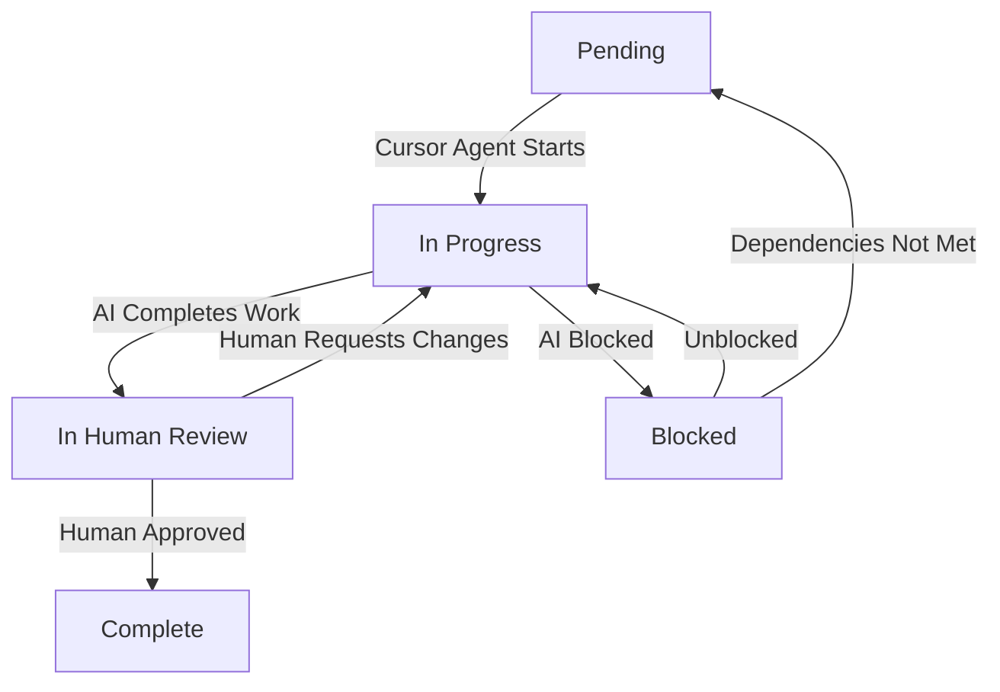

# Task Status Workflow

## Overview
This document defines the task status workflow for the MRHB & Creditcoin integration project. The workflow is primarily driven by the Cursor Agent in the IDE, with human review serving as a critical validation step to ensure accuracy and completeness of AI-generated artifacts.

## Status Definitions

### 1. Pending
- **Description**: Initial state for newly created tasks
- **Conditions**:
  - Task has been created but not yet started
  - Dependencies are not yet satisfied
  - Resources are not yet allocated
- **Next Possible States**: In Progress

### 2. In Progress
- **Description**: Task is being actively worked on by the Cursor Agent
- **Conditions**:
  - Cursor Agent has begun processing the task
  - Dependencies are satisfied
  - Regular updates are being made
  - AI is generating and iterating on artifacts
- **Next Possible States**: In Human Review, Blocked

### 3. Blocked
- **Description**: Task cannot proceed due to external factors
- **Conditions**:
  - External dependency is not met
  - Required resource is unavailable
  - Technical blocker exists
  - Cursor Agent requires additional context or clarification
- **Next Possible States**: In Progress, Pending

### 4. In Human Review
- **Description**: AI-generated artifacts are ready for human validation
- **Conditions**:
  - Cursor Agent has completed its work
  - All acceptance criteria are met according to AI assessment
  - Documentation and code changes are generated
  - Ready for human validation of accuracy and completeness
- **Purpose**:
  - Validate AI-generated artifacts against reality
  - Check for hallucinations or incorrect assumptions
  - Ensure context completeness
  - Verify technical accuracy
  - Confirm alignment with project requirements
- **Next Possible States**: Complete, In Progress

### 5. Complete
- **Description**: Task has been completed and human-validated
- **Conditions**:
  - All acceptance criteria are verified by humans
  - Documentation is approved
  - Code changes are validated
  - AI-generated artifacts have been refined as needed
- **Next Possible States**: None (final state)

## Status Transitions

## Status Update Guidelines

### When to Update Status
1. **To Pending**
   - When creating a new task
   - When dependencies are not met
   - When resources are not available

2. **To In Progress**
   - When Cursor Agent begins processing
   - When unblocking a task
   - When making changes after human review

3. **To Blocked**
   - When Cursor Agent encounters blockers
   - When dependencies are not met
   - When additional context is needed

4. **To In Human Review**
   - When Cursor Agent completes its work
   - When all AI-generated artifacts are ready
   - When ready for human validation

5. **To Complete**
   - When human review is successful
   - When all artifacts are validated
   - When changes are approved

### Required Documentation
- Status changes must be documented in the task's revision history
- Blocked status requires explanation of the blocker
- In Human Review status requires:
  - List of AI-generated artifacts
  - Areas requiring human validation
  - Potential risk areas for hallucinations
- Complete status requires:
  - Human validation summary
  - List of refinements made
  - Final artifact versions

## Revision History

| Date | Version | Changes | Author |
|------|---------|---------|--------|
| 2024-04-20 | 1.0 | Initial draft | Technical Team |
| 2024-04-20 | 1.1 | Updated to clarify Cursor Agent role and Human Review purpose | Technical Team | 